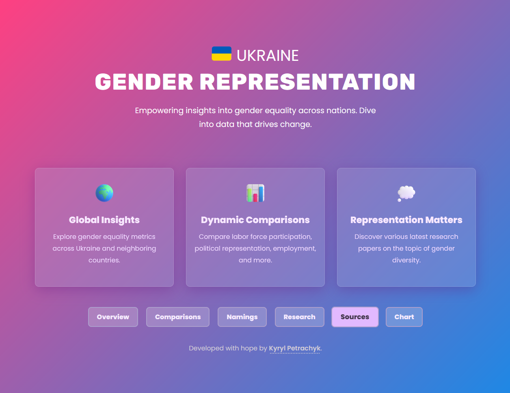
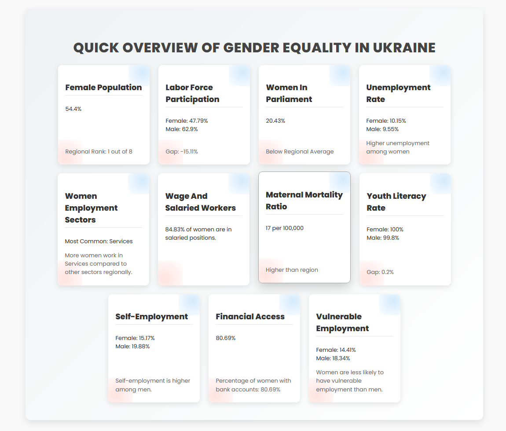
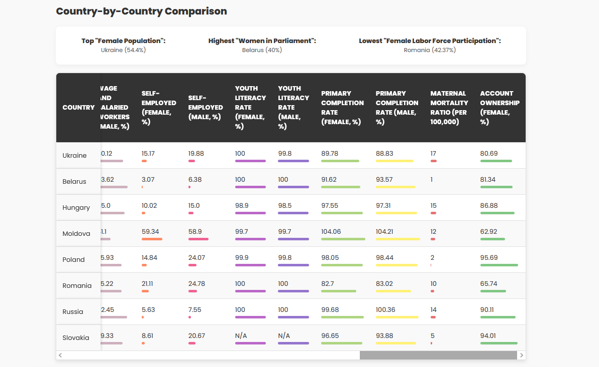
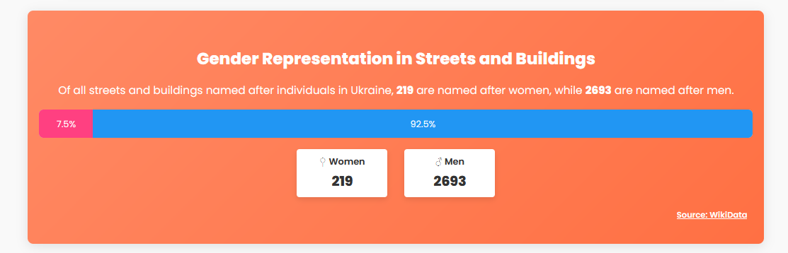
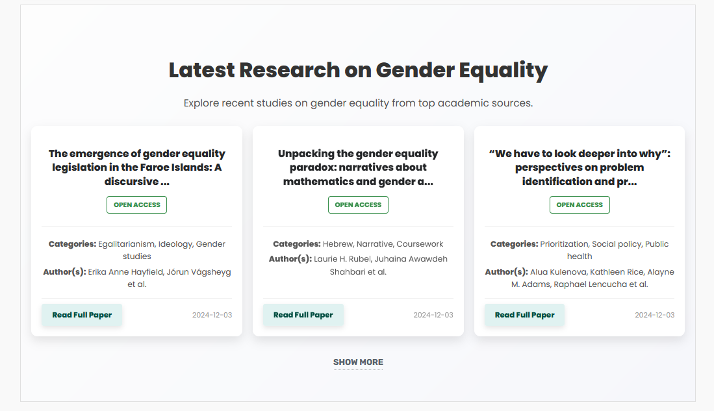
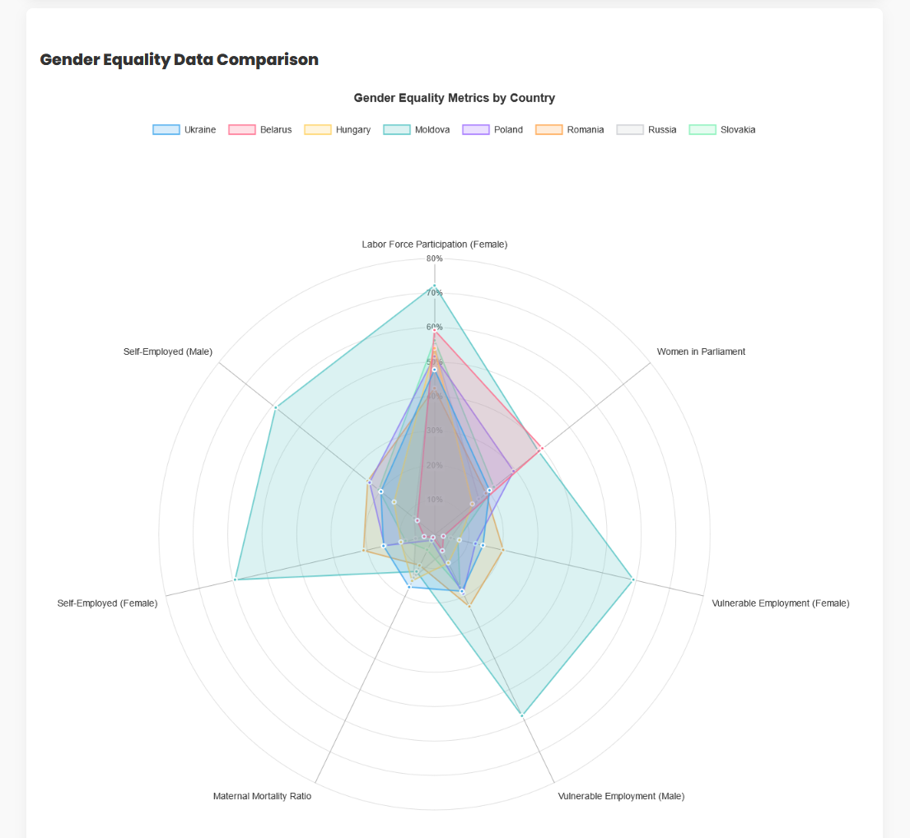

# Gender Equality Tracker 🫂 


The **Gender Equality Tracker** is a data-driven web application that provides comprehensive insights into gender equality across Ukraine and neighboring countries. It aggregates data from reliable sources like the World Bank, OpenAlex, and Wikidata, presenting metrics on labor force participation, political representation, employment, and more. In the future development cycles, the project may be transformed to dynamically present data on multiple countries.

  

⚠️ **This project is not finished. Expect plenty of obvious errors and rough edges.** Feedback, contributions, and suggestions are welcome to help polish it into something amazing & useful.

🔖 **Please note:** The application currently takes nearly **20 seconds** to load due to the extensive fetching of live data from multiple sources. This will be optimized in future iterations to improve performance.

---

## Features 🚀  

- **Interactive Data Visualizations**  
  Analyze gender equality metrics through dynamic comparisons, barometers, and charts.  

- **Global & Regional Insights**  
  Discover detailed metrics for Ukraine and its neighboring countries.  

- **Research Explorer**  
  Browse the latest academic research on gender equality from OpenAlex.  

- **Representation Analysis**  
  Uncover how streets and buildings are named after men and women in Ukraine.

---

## Getting Started 🛠️  

Follow these steps to set up the project locally:  

### Prerequisites  

- **Python 3.8+**  
- **Flask** for the backend  
- **Pip** for dependency management  

### Installation  

1. **Clone the repository**:  
   ```bash
   git clone https://github.com/raccoon-hero/gender-equality-tracker.git  
   cd gender-equality-tracker  
   ```  

2. **Install dependencies**:  
   ```bash
   pip install -r requirements.txt  
   ```  

3. **Run the server**:  
   ```bash
   flask run  
   ```  

4. **Access the app**:  
   Open your browser and navigate to `http://127.0.0.1:5000`.  

---

## Project Structure 📂  

```plaintext
gender-equality-tracker/
├── assets/                     # Screenshots for project showcase
├── data_fetching/              # Scripts for data retrieval
│   ├── fetch_dbpedia.py        # (work in progress) Fetches gender equality activists from DBPedia
│   ├── fetch_openalex.py       # Retrieves research papers from OpenAlex
│   ├── fetch_wikidata.py       # Fetches gender-related data from WikiData
│   └── fetch_world_bank.py     # Pulls gender equality metrics from World Bank API
├── static/                     # Static files for styling and assets
│   ├── assets/                 # Additional assets (e.g., images)
│   └── style.css               # Custom CSS styles
├── templates/                  # HTML templates for the frontend
│   └── index.html              # Main webpage template
├── app.py                      # Flask application entry point
├── requirements.txt            # Python dependencies
└── README.md                   # Project documentation (you’re here! :D)
```  

---

## Screenshots 🖼️ 

### Header  
  

### Quick Overview  
  

### Table Data  
  

### Representation in Naming Barometer  
  

### Research Explorer  
  

### Metrics Chart  
 

---

## Data Sources 📊  

Data is leveraged dynamically from the following open sources:  

- **[World Bank](https://worldbank.org)**: Global development indicators.  
- **[OpenAlex](https://openalex.org)**: Scholarly research papers.  
- **[Wikidata](https://wikidata.org)**: Gender representation via streets/buildings naming.

---

## Future Plans 🚀  

- Add support for more countries.  
- Improve data caching to enhance performance and reduce API reliance.  
- Refactor the CSS for better organization and maintainability.  
- Include additional gender equality metrics, like education gaps and wage disparities.  

---

## Contributing 🤝

1. Fork this repository.
2. Create a feature branch (`git checkout -b feature/amazing-feature`).
3. Commit your changes (`git commit -m 'Add some amazing feature'`).
4. Push to the branch (`git push origin feature/amazing-feature`).
5. Open a Pull Request.
